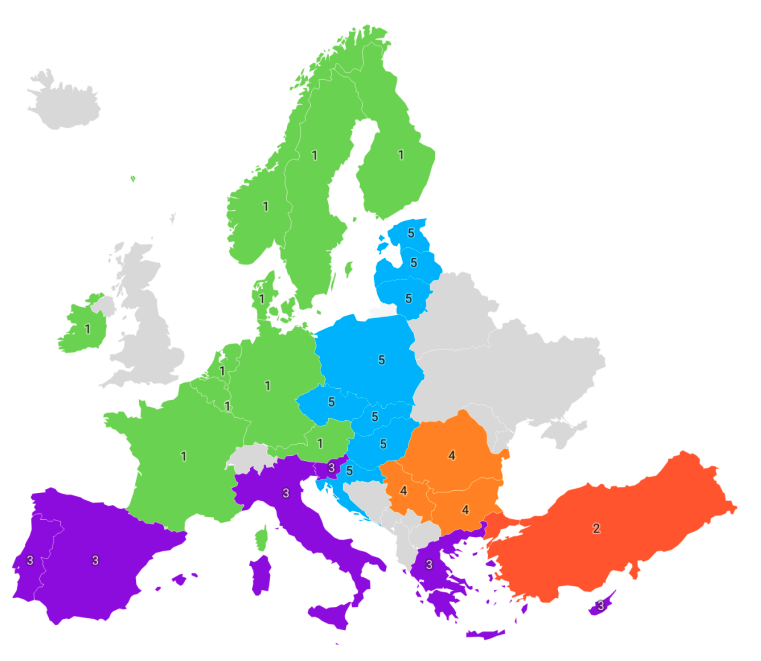

# Quality of Life in European Countries

### Project summary:

The study analyses the quality od life in selected 30 European countries based on the collected 22 quantitative variables.  

Main goal of the study is to determine groups of countries with similar characteristics.  

The data used in the project comes from publicly available sources and includes various social and economic indicators that can affect life satisfaction. 

The data is from 2020 and 2019, due to the lack of more recent data available.  

Data sources: Eurostat, Our World in Data, The World Bank, OECD.  

Data analysis was carried out using:
- Correlation Analysis 
- PCA (Principal Component Analysis)
- Cluster Analysis

# Results

### Correlation Analysis

Correlation analysis indicated many strong correlations, both positive and negative.

### PCA

Based on principal component analysis, the countries formed six groups that achieved similar values for the characteristics studied.

### Cluster Analysis

Countries belonging to the relevant groups, formed on the basis of cluster analysis, are shown on a map of Europe:

Source: Own development using the Datawrapper.de

The first group (green) comprises the countries of northern and Western Europe. This group includes the Nordic countries, i.e. Denmark, Norway, Sweden, Finland and the 'Old European Union' countries, namely France, the Netherlands, Luxembourg, Germany and Belgium, as well as Austria and Ireland.

The second group is Turkey (red). The values of the surveyed variables for Turkey distinguish it significantly from the other analysed countries.

The third group (purple) consists of the countries of Mediterranean Europe, which include Portugal, Spain, Italy, Malta, Greece, Cyprus and Slovenia.

The fourth group (orange) includes three Balkan countries such as Romania, Serbia and Bulgaria.

The fifth group consists of the countries of Central and Eastern Europe (blue), includes Lithuania, Latvia, Estonia, Poland, the Czech Republic, Slovakia, Hungary and Croatia.
